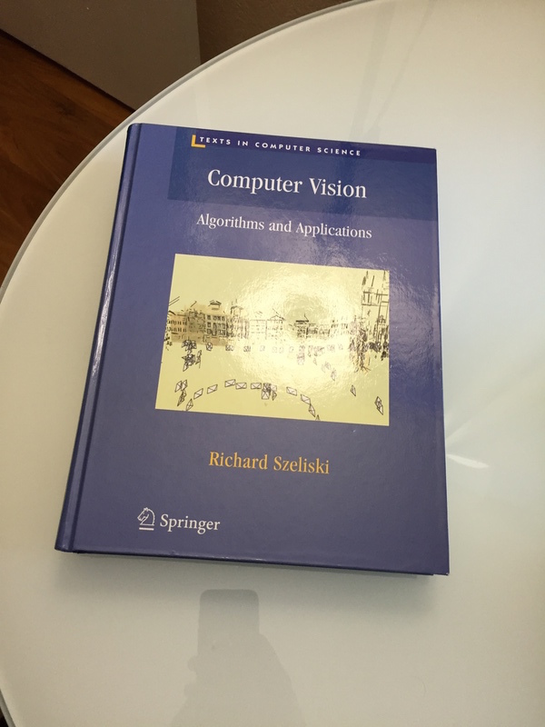
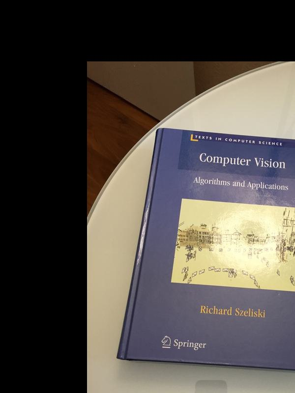
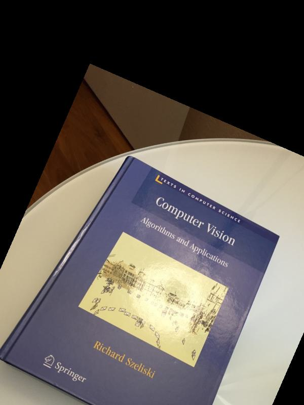
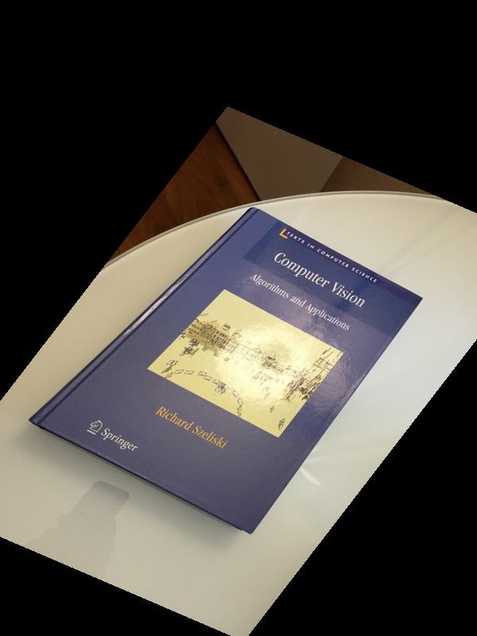
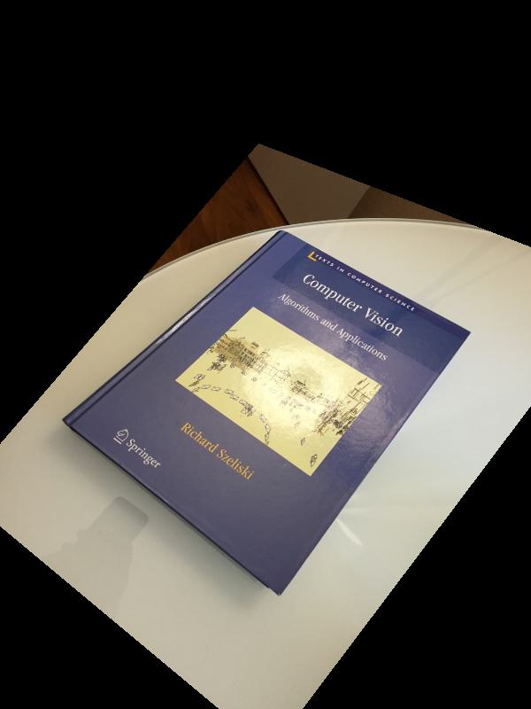
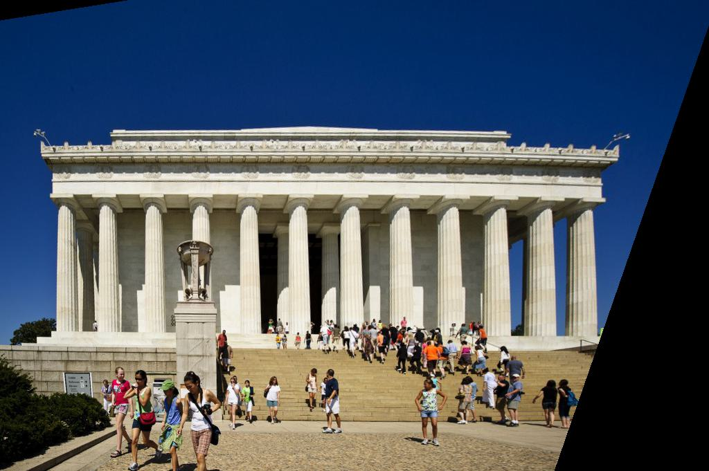

# part2.py Procedure 
## Steps taken:
- Find transformation matrix 
- Inverse warp
- Bilinear interpolation

# Find transformation matrix
- Create a transformation matrix based on option from command line
- Used a different procedure for finding transformation matrices based on the option from command line
- Reshape the transformation matrix into 3x3 matrix  
- Return the inverse of the transformation matrix

### Create transformation matrix

**n=1 (Translation)**
- For n=1, I used tx = x-x' and ty=y-y' directly instead of using numpy's solver.
- The resulting matrix looks like [[1,0,tx],[0,1,ty],[0,0,1]]
- This matrix calculates translation from destination to source, I return the inverse of this matrix to get mapping of points from source to destination.

**n=2 (Eucledian/ Rigid Transformation)**
- For n=2, I find the translation matrix as defined above
- I find the rotation matrix as multplication of 3 shear matrices
- The three shear matrices are
    - sh1: [[1, -np.tan(rad/2),0],[0,1,0],[0,0,1]]
    - sh2: [[1, 0,0],[np.sin(rad),1,0],[0,0,1]]
    - sh3: [[1, -np.tan(rad/2),0],[0,1,0],[0,0,1]]
- I then reshape each shear matrix to 3x3 shape which easies multiplication operation and multiply them 
- I multiply the resulting rotation matrix with translation matrix which returns a transformation matrix

**n=3 (Affine transform)**
- For n=3, I use system of linear equations to solve for transformation matrix
- The solution is a closed form solution and is obtained by H = A^-1.b 
- The final matrix is of form [[a,b,c],[d,e,f],[0,0,1]]

**n=3 (Projective transform)**
- For n=4, I use system of linear equations to solve for transformation matrix
- The solution is a closed form solution and is obtained by H = A^-1.b 
- The final matrix is of form [[a,b,c],[d,e,f],[g,h,1]]

# Inverse warp
- I multiply a homogenous point in an empty image [c,r,1] with inverse of the transfrom matrix to find an inverse projection point. The resulting point is of the form [x_,y_,w]
- I adjust the values for x_ and y_ coordinates with w.
- I then call bilinear interpolation on the the point (x_,y_) if it lies within the bounds of the original image and fill the pixel values at that location from original image

# Biliear Interpolation
- I take the inverse projected coordinates of the new image and then try to find pixel values from source image
- If the values of coodinates are within bounds of original image, it Biliear Interpolation finds values for that pixel 
from it's neighbouring pixels
- I used a weighted sum to calculate the final pixel values
- The weights are based on distance of the projected point from it's nearest pixels (nearest integer in x and nearest integer in y). For example if dx is distance of point from nearest integer x value and dy is the distance of point from nearest integer y value, a point at [x1,y1] can have a weight of (1-dx)*(1-dy) and a point [y2,x2] can have a weight of dx*dy

## Some environment setup guidelines that I followed
- I created a new conda environment for CV with it's environment.yml file.
- I included all packages necessary for my algorithms in this file and I create and update the environment based on the following commands

### Creating conda env
-  conda env create --file=environment.yml

### Update conda env
- conda env update --name="name of env" --file=environment.yml

# Assumptions
- I assume that the input format for part 2 would be: part2 n destination_image_path source_image_path output_image_path coordinates of destination image coordinates of source image ... coordinates of destination image coordinates of source image

# Some results from book images

## inputs 

### source image

### destination image

## outputs 

### n=1 -> Translation

### n=2 -> Euclidean

### n=3 -> Affine

### n=4 -> Projective

# Results on the lincon image 

### source image

### output

# Sample commands
- We have added sample commands in commands.txt which might be helpful to run the code as a source file
- Prior to running the source file, we make the file executable using chmod +x a2